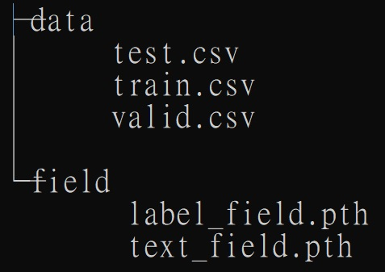

# 聯邦學習LSTM模型-預測文字情緒
## 環境
+ 作業系統: Window 10
+ 程式語言: Python 3.9.12 (須已安裝好Anaconda)
+ Anaconda套件:
  + numpy - 1.23.2
  + torch - 1.12.1
  + torchtext - 0.6.0
  + flwr - 1.0.0
## 訓練
### 前置作業
1. 以文本資料建置Field檔案，以讓TabularDataset辨認正確資料欄位，建立詞字典
```
$ python build_field.py ./emotion.csv --saving-directory=./field
```
2. 切割原始訓練資料集為三部分，訓練、驗證、及測試集(指令取消'-t'可只產生訓練及驗證集)
```
$ python split_dataset.py ./emotion.csv -t
```
此時工作目錄有以下兩個資料夾，前置作業即完成 
</img>
### 集中式訓練
預設epoch為5、batch size為32、學習率為0.001
```
$ python train_centralized_model.py ./data/train.csv ./data/valid.csv
```
更改參數以調整訓練Hyperparameter
```
$ python train_centralized_model.py ./data/train.csv ./data/valid.csv --epoch=3 --eval-time=2 --batch-size=16 --learning-rate=0.005
```
訓練完成後，將產生model.pt及metrics.pt兩個檔案
### 聯邦式訓練
#### Server
啟動模型聚合Server，預設round數為2、local epoch為2、batch size為32、學習率為0.001、至少參與client數為2
```
$ python train_federated_server.py
```
同樣可以更改參數以調整聚合訓練Hyperparameter
```
$ python train_federated_server.py --local-epoch=2 --eval-time=2 --batch-size=32 --learning-rate=0.001 --num-round=5 --fraction-fit=1.0 --fraction-evaluate=1.0 --min-fit-clients=4 --min-evaluate-clients=4 --min-available-clients=4
```
#### client
啟動訓練client，每個client工作目錄皆需有data、field兩個資料夾
```
$ python train_federated_client.py ./data/train.csv ./data/valid.csv ./data/test.csv
```
## 測試
準備測試資料集及model.pt檔案
```
$ python test_model.py ./model.pt ./data/test.csv
```
測試範例如下
```
Model loaded from <== ./model.pt
100%|█████████████████████████████████████████████████████████████████████████████████| 57/57 [00:00<00:00, 168.07it/s]
loss: 0.24011342253601342
accuracy: 0.9444444444444444
```
## 繪製Loss值圖表
準備metrics.pt檔案，可根據需求更改x軸欲顯示字樣
```
$ python draw_loss_chart.py ./metrics.pt --x-axis-str="Global Steps"
```
## 推論(Inference)
準備model.pt檔案，可使用指令式或者持續輸入字串的互動式inference
+ 指令式
```
$ python inference.py ./model.pt --inference-sentence="I am happy now"
```
+ 互動式
```
$ python inference.py ./model.pt -i
```
互動式範例如下
```
Model loaded from <== ./model.pt
Type 'exit()' to exit
Please input a sentence> I am happy now
The emotion of this sentence is 'joy'
Please input a sentence> I feel like I have to make the suffering I M seeing mean something
The emotion of this sentence is 'sadness'
Please input a sentence> exit()
bye~
```
